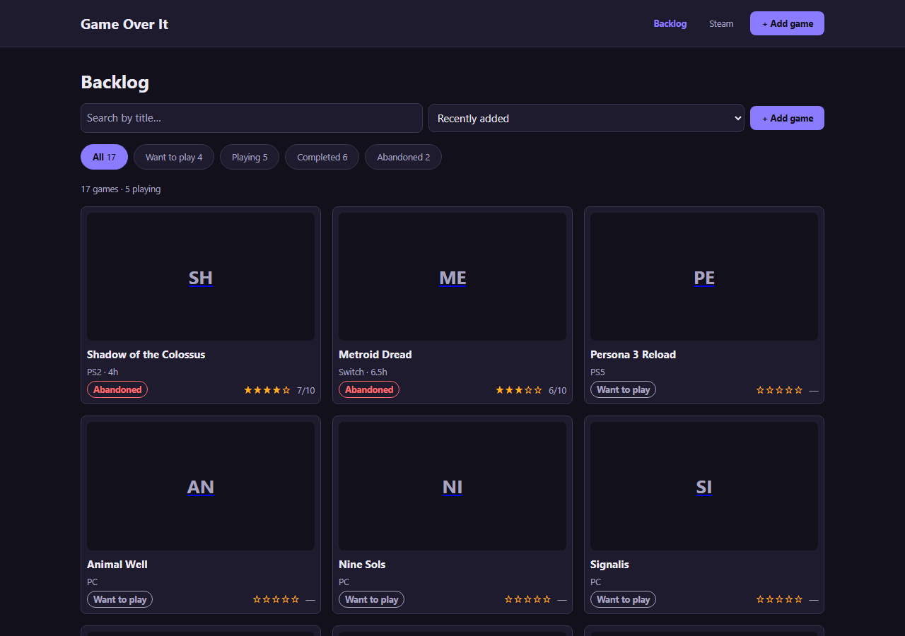

# Game Over It

A personal video-game backlog tracker with a one-button Steam import.

**Repository:** https://github.com/Piedot3000/GameOverIt

**Live site:** https://piedot3000.github.io/GameOverIt/

## AI usage

[](AI-USAGE.md)

Deepseek was used extensively throughout this project. Some parts are mine and some are
AI, and some are a mix of both. Accounts of usage are in: 

[AI-USAGE.md](AI-USAGE.md)
names each file with the commit on it.

## 1. Overview

A spreadsheet cannot tell "bought it" apart from "playing it", and a store wishlist
disappears the moment you buy the game. Game Over It is one list that does both jobs: what you
mean to play, what you are playing, what you finished, and what you gave up on.

The other half is Steam. Connect a public profile and the backlog is seeded from the games
that account already owns, instead of typing in two hundred rows by hand. It is built for a
single user: no accounts, or sign-in.

React 18 and Vite on the front end, Express 4 and PostgreSQL on the back end. No UI framework:
the design system is plain CSS with custom-property tokens.

## 2. Setup and installation

**What to install first**

| Tool | Version used here | Notes |
| --- | --- | --- |
| Node.js | 26 | Any 20 or newer works. |
| npm | ships with Node | |
| PostgreSQL | 16 | Any 16.x works. Install it, or use a hosted database. |

**Get the code and install dependencies**

```bash
git clone https://github.com/Piedot3000/GameOverIt.git
cd GameOverIt

cd server && npm install
cd ../client && npm install
```

**Environment and configuration**

Copy each `.env.example` to `.env` in the same folder and fill it in. `.env` is git-ignored;
the examples are committed and hold placeholders only.

| Variable | Where | Example | What it is |
| --- | --- | --- | --- |
| `DATABASE_URL` | server | `postgresql://postgres:pw@localhost:5432/gameoverit` | PostgreSQL connection string |
| `CORS_ORIGINS` | server | `http://localhost:5173` | Origins allowed to call the API |
| `STEAM_API_KEY` | server | `your-key-here` | Steam Web API key. Optional |
| `NODE_ENV` | server | `development` | `production` on a host |
| `PORT` | server | - | **Set by the host.** Do not set it yourself |
| `VITE_USE_MOCK_API` | client | `true` | Only `false` turns demo mode off |
| `VITE_API_BASE_URL` | client | `http://localhost:3000` | Your API's URL, no trailing slash |

Every `VITE_` value is compiled into the built JavaScript, so it is **public**. Never put a
key, a password or a connection string in one - that is why the Steam key is read by the
server only.

**Set up and seed the database**

```bash
cd server && npm run db:reset      # creates the tables and adds 17 sample rows
```

## 3. How to run it

```bash
cd client
cp .env.example .env        # leave VITE_USE_MOCK_API unset or true
npm run dev                 # open http://localhost:5173
```

You should see the backlog with games. Requests are answered inside
the browser, so nothing is saved and nothing is shared between visitors.

The whole stack needs a PostgreSQL - a local install or a hosted one; only the connection
string in `server/.env` changes. Start the parts in order:

```bash
# 1. database, once
cd server && npm run db:reset

# 2. API
cd server && npm run dev            # http://localhost:3000

# 3. client, in another terminal
cd client
cp .env.example .env                # set VITE_USE_MOCK_API=false
npm run dev                         # http://localhost:5173
```

The backlog opens with the 17 sample games, this time from PostgreSQL. Check the API:

```bash
curl http://localhost:3000/healthz      # is the process alive
curl http://localhost:3000/readyz       # is the database reachable
curl http://localhost:3000/api/games    # the backlog itself
```

The Steam import needs a key from <https://steamcommunity.com/dev/apikey>, set as
`STEAM_API_KEY`. Without one the API says no. Connecting returns `503` with
`code: "UNCONFIGURED"`, and adding games by hand keeps working.

## 4. Features and usage

The primary flow: the backlog opens -> **Add game** -> type a title, pick a status, save -> the
new row appears in the list -> click it -> change the status to *playing* -> the change is saved
and visible back in the list. There are four screens - backlog, add, detail and Steam - behind
one shared layout, and every screen has a way back.

- **See the whole backlog**, newest first, as cards with cover art, platform, hours and rating.
- **Filter by status** - All, Want to play, Playing, Completed, Abandoned - each with a live
  count, and **search by title**.
- **Sort** by recently added or updated, by title, or by rating.
- **Add a game.** Title and status are required; platform, rating, hours, cover art, notes and a
  finish date are optional. Completed and Abandoned stamp the finish date for you.
- **Open a game** to see every field and its three dates, then edit it in place or delete it
  after confirming.
- **Connect Steam** by profile URL, vanity name or 64-bit ID, and **sync** the games it owns.
  Playtime arrives in minutes and is stored in hours.
- **A sync never overwrites what you set.** Games match on Steam app id, so re-syncing imports
  nothing twice and updates playtime only - your status, rating, notes and cover art survive.
- **A private Steam library is explained**, instead of reported as a successful import of zero games.

| Method | Path | What it does |
| --- | --- | --- |
| `GET` | `/healthz` | Is the process alive |
| `GET` | `/readyz` | Is the database reachable |
| `GET` | `/api/games` | The backlog - supports `?status=`, `?q=` and `?sort=` |
| `POST` | `/api/games` | Add a game - `201` with the created row |
| `GET` | `/api/games/:id` | One game |
| `PATCH` | `/api/games/:id` | Update any field |
| `DELETE` | `/api/games/:id` | Remove a game - `204`, no body |
| `GET` | `/api/steam/profile` | The connected Steam profile, if any |
| `POST` | `/api/steam/connect` | Resolve and store a profile |
| `POST` | `/api/steam/sync` | Import owned games, without overwriting your edits |
| `DELETE` | `/api/steam/profile` | Disconnect, keeping every imported game |

Failures are one sentence: `400` with a field-level message, `404` for a
missing game, `502` when Steam is unavailable, `503` when no key is configured.

## 5. Project structure

    client/          React front end, built by Vite
      scripts/       contrast-check.mjs, which reads the tokens and checks every pair
      src/api/       ONE interface, two implementations, chosen by one variable
      src/components/  atoms, molecules, organisms
      src/pages/     the four screens: backlog, add, detail, steam
    server/          Express API
      db/            pool, schema.sql, seed.sql, and a runner for them
      handlers/      the request logic, one module per resource
      routes/        URL to handler, every handler wrapped so a rejection cannot kill the process
      steam/         the Steam Web API client and its error types
      validators/    server-side input rules
    docs/            design documents, wireframes, weekly reports and the screenshot
    SECURITY-CHECKLIST.md   every security and privacy row, with how it was verified

The browser talks only to the Express API: it never calls Steam and never sees the API key. The
API holds the only database connection and the only Steam credentials.

## 6. Screenshots



The backlog, with the status filter chips, search, sort control and rating stars.

## 7. Known issues and next steps

**Known issues**

- **The Steam import needs a key.** Without `STEAM_API_KEY`, connecting returns `503`; the rest
  of the app is unaffected.
- **A sync reads then writes each game**, which is invisible at 17 rows and would be the first
  thing to fix at a few thousand.
- **The database user is the local superuser.** Acceptable on one laptop, not on a host.

**Next steps, in order**

1. Import from more than Steam. The sync is one handler with one upstream, so a second source
   is a sibling module rather than a rewrite.
2. Send the sync as one query per game instead of one per row.

## Accessibility checklist

Each item is ticked only where it was verified against the running app.

- [x] **Text contrast is at least 4.5 : 1** - `node client/scripts/contrast-check.mjs` reports
  **0 failures** across 16 usages (14 distinct pairs), reading its values from `tokens.css`. A
  real failure was found and fixed: the active filter chip's count measured **4.38 : 1** because
  `opacity: 0.8` composited it toward the chip behind; removing that took it to **5.72 : 1**.
  Reviewed in greyscale too.
- [x] **Real semantic elements** - every screen renders `header`, `nav`, `main` and `footer`, and
  exactly one `h1`.
- [x] **Images have `alt` text** - cover art carries the game title; the initials placeholder is
  `aria-hidden` because the title already sits beside it.
- [x] **Every input has a `<label>`** - no unlabelled input, select or textarea. The detail
  screen's status select was the one failure; it now uses `FormField`.
- [x] **Tab reaches every control, with a visible focus ring** - the order is
  brand -> Backlog -> Steam -> Add game -> search -> sort, each with a computed `outline: solid`.
- [x] **Failure is never colour-only** - `StatusBadge` always prints the status word, and
  `ErrorMessage` is a sentence, not a red border.
- [x] **Deleting cannot happen by accident** - `ConfirmDialog` is the only path to it: focus
  moves to its confirm button, Tab stays inside, Escape closes without deleting, and focus
  returns to where it came from.

## Author

name - course and section. 

## Licence

MIT, see [LICENSE](LICENSE).
